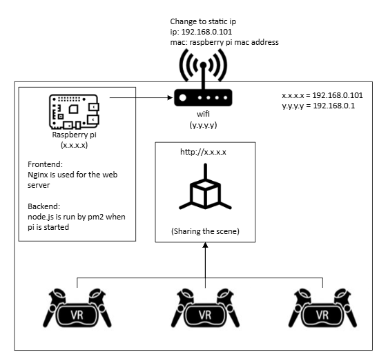

# Install nvs
1. Check how to install on https://github.com/jasongin/nvs
2. `winget install jasongin.nvs`
3. `source ~/AppData/Local/nvs/nvs.sh` in .bashrc

## To use nvs
- `nvs add X.X.X` # X.X.X should be node.js version
- `nvs ls` # show which node.js versions you installed in your laptop
- `nvs use X.X.X` # now you can use node.js. In this case, `nvs use 22`

# Create a project at first time
1. `npm create vite@latest XXX`
2. `cd XXX`
3. `npm install`
4. `npm install three @react-three/fiber@9` # if react19 is used, fiber@9. if react18, fiber@8

# Run frontend
`npm run dev`

# Run backend
`node backend/server.js`

# Android Debug Bridge
This can communicate between laptop and vr headset for debug
## Install adb tool
1. Download "Download SDK Platform-Tools for Windows" from https://developer.android.com/tools/releases/platform-tools#downloads
2. Move "platform-tools" folder location in where you want to storage.
3. Copy this folder path
4. Open setting app and open "Edit environment variables for your account"
5. Navigate: User variables for YOURNAME -> Path -> Edit... -> New. Then, paste the path from the step 3.

## To use
1. connect between the heatset and the laptop via usd.
2. open terminal
3. `adb devices` # show what andloid devices are connected in your laptop
4. `adb reverse tcp:5173 tcp:5173` # bridge between your laptop's localhost:5173 to the vr headset (you need to visit same localhost name on any browser in the headset)
5. `adb reverse tcp:3001 tcp:3001`
6. `adb reverse --remove-all` # disconnect

# Final product idea
